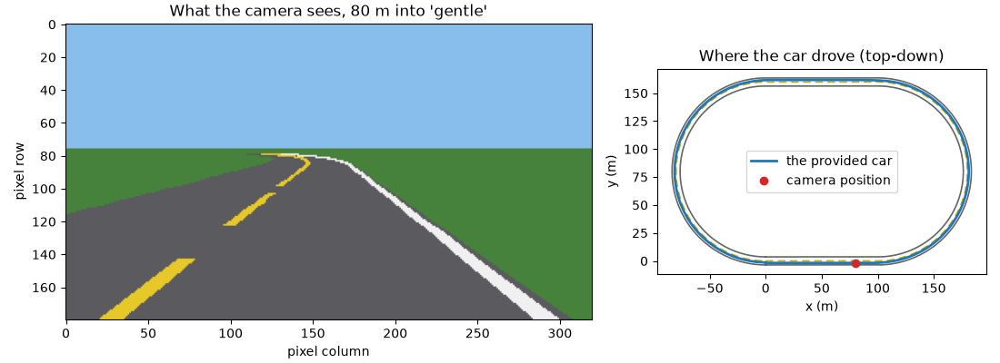
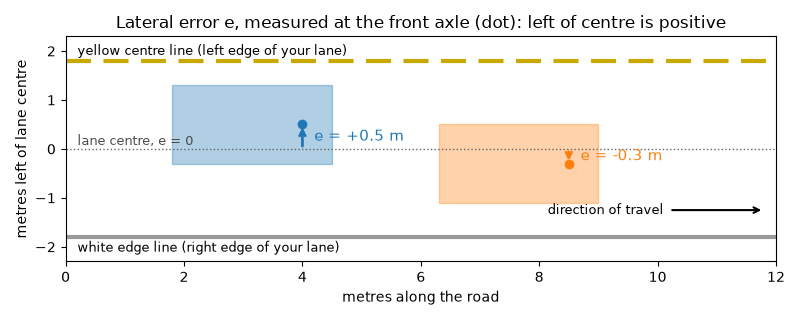

# Meet your car

## The car you were handed

Picture a two-lane road on a clear day. A dashed yellow line runs down the middle and a solid white line marks the right edge. You are in the right-hand lane, rolling at a steady 8 m/s (about 29 km/h), and you are not steering. The car is.

Every 0.05 seconds, the same four things happen:

1. The **camera** takes a picture of the road ahead.
2. The **perception box** looks at that picture and reports where the lane is.
3. The **controller box** turns that report into a steering angle.
4. The **vehicle** moves a little, and the camera takes the next picture.

This course's car lives in a flat-world teaching simulator: the road is paint on a perfectly flat plane, and the car moves like a simple bicycle with a 2.7 m wheelbase. Nothing about it is secret. You will open every box during this course, starting with perception in unit 0.1.3 and the controller in unit 0.1.4. In this unit you open nothing. You **instrument** the car instead: you record what it did and boil a whole drive down to a few honest numbers.



The right panel shows `gentle`, one of the three test roads: a stadium-shaped loop with two 100 m straights and two bends of radius 80 m, 702.7 m in all. The other two are `straight` (200 m of straight road) and `curvy`, which is 30 m of straight followed by six quarter-circle bends of radius 20 m that alternate left and right.

## Lateral error

How would you say, in one number, how well a car is keeping its lane? Teams building real robot cars had to answer this too. Stanford's Stanley, which won the 2005 DARPA Grand Challenge desert race, built its steering on exactly one number:

> "The key error metric is the cross-track error, x(t), as shown in Figure 24, which measures the lateral distance of the center of the vehicle's front wheels from the nearest point on the trajectory." (Thrun et al., 2006, p. 684)

This course calls that number the **lateral error**, written $e$. It is the sideways distance, in metres, from the centre of your lane to the centre of the car's front axle (the point between the front wheels, where the simulator mounts the camera).

$e$ has a sign, and the sign carries information:

- $e > 0$: the car is to the **left** of lane centre.
- $e < 0$: the car is to the **right** of lane centre.
- $e = 0$: the front axle is exactly on the centre line of the lane.



Left is positive everywhere in this course, for offsets, headings and steering angles. Hold on to that; every sign bug you will ever write comes from forgetting it.

The lane is 3.6 m wide, so the yellow line is 1.8 m to your left and the white line 1.8 m to your right. When $|e|$ reaches 1.8 m the front axle is on a line, and the simulator ends the run.

A drive is not one number but a **time series**: one value of $e$ at every step. Call them $e_1, e_2, \ldots, e_N$, where $N$ is the number of steps. With a step every 0.05 s you get 20 values per second, so one lap of `gentle`, which takes the provided car 88.85 s, is $N = 1778$ values. In the lab they arrive as a NumPy array called `tel.lat`.

## Summarising lane error

Nobody can compare two cars by reading 1,778 numbers each. You want a few numbers that each answer a clear question. Here are the three this course uses. In each, the symbol $\sum_{t=1}^{N}$ means "add up the thing that follows for $t = 1, 2, \ldots, N$", and $|e_t|$ is the size of $e_t$ with its sign dropped.

**Mean absolute error** answers "how far from centre was the car, typically?":

$$\text{mean}|e| = \frac{1}{N}\sum_{t=1}^{N} |e_t|$$

**Maximum absolute error** answers "how bad was the worst moment?":

$$\max|e| = \max_{t} |e_t|$$

**Root mean square (RMS) error** answers "how far from centre, typically, counting big errors extra?". Read it from the inside out: square each error, take the mean of the squares, then take the square root.

$$\text{RMS}(e) = \sqrt{\frac{1}{N}\sum_{t=1}^{N} e_t^{2}}$$

**Worked example.** Take five lateral errors, in metres:

$$e = (0.1,\ -0.3,\ 0.2,\ -0.4,\ 0.4)$$

- Drop the signs: $|e| = (0.1, 0.3, 0.2, 0.4, 0.4)$. They add up to $1.4$, and $1.4 / 5 = 0.28$. So $\text{mean}|e| = 0.28$ m.
- The largest of those is $0.4$, so $\max|e| = 0.4$ m.
- Square each error: $(0.01, 0.09, 0.04, 0.16, 0.16)$. The squares add up to $0.46$, and $0.46 / 5 = 0.092$. The square root of $0.092$ is $0.303$, so $\text{RMS}(e) = 0.303$ m.

Notice the units. Squares of metres are square metres; the square root brings you back to metres, which is why RMS can sit beside mean $|e|$ on the same scale.

For the provided car's lap of `gentle`, the simulator reports mean $|e|$ = 0.38 m, max $|e|$ = 0.53 m and RMS = 0.44 m. In the lab you will write the function that computes all three.

## The signed-mean trap

Here is the tempting shortcut: "Just average $e$ itself. Left and right errors will show which side the car favours, and a small average means good lane-keeping."

Try it on the worked example. The signed mean is

$$\frac{0.1 - 0.3 + 0.2 - 0.4 + 0.4}{5} = \frac{0.0}{5} = 0.0 \text{ m}$$

A perfect score, for a car that was off centre at every single step. The positive errors cancelled the negative ones.

This is not a toy problem. Here are two real drives from the simulator:


On the left, the provided car on `gentle` drifts to the inside of each left-hand bend and stays there, so every error is positive and the signed mean equals mean $|e|$: both are 0.38 m. On the right, a car with a stiffer steering setting (you will meet steering gains in unit 0.1.4) drives `curvy`. It cuts to the inside of every bend, which is left on the left bends and right on the right bends. Its signed mean is +0.02 m, which makes it look far better than the first car. Its mean $|e|$ is 0.50 m, so it is actually further from centre, on average.

The signed mean answers a different question: "on average, which side does the car favour?". That is called **bias**, and it is worth knowing. It is not a measure of how far the car strays, and it must never be used as a quality score. Taking the absolute value, or squaring, turns every error into a cost that cannot be cancelled.

## Why RMS punishes big errors

Take two five-step drives with the same mean $|e|$:

- Drive A: $(0.2, 0.2, 0.2, 0.2, 0.2)$, which is always a little off.
- Drive B: $(0, 0, 0, 0, 1.0)$, which is perfect, then one big swerve.

Both have $\text{mean}|e| = 1.0/5 = 0.2$ m. Now the RMS:

- A: the squares are all $0.04$, their mean is $0.04$, and $\sqrt{0.04} = 0.2$ m.
- B: the squares are $(0, 0, 0, 0, 1.0)$, their mean is $0.2$, and $\sqrt{0.2} = 0.447$ m.

Why the difference? The swerve of 1.0 m is 5 times the steady 0.2 m, but its square, $1.0$, is 25 times $0.04$. Squaring grows big numbers much faster than small ones, so one large error dominates the mean of the squares.

That matches driving. Being 0.2 m off centre all the time never puts a wheel near a line. Being 1.0 m off for a moment might. When the worst moments matter most, look at RMS and $\max|e|$, not only mean $|e|$.

One more fact you can check on every example here: RMS is never smaller than mean $|e|$ (0.303 ≥ 0.28, 0.447 ≥ 0.2). The two are equal only when every $|e_t|$ is the same, as in drive A. The more uneven the errors, the wider the gap.

## Counting steps off the lane

Some questions are yes or no at each step. "Was the car more than 0.9 m from centre just now?" The course uses 0.9 m, half the 1.8 m distance from lane centre to a line, as its **off-lane** limit. A step is off the lane when

$$|e_t| > 0.9 \text{ m}$$

The comparison is strict: a step at exactly 0.9 m is on the limit, not over it.

NumPy answers this question for every step at once. `np.abs(e) > 0.9` gives an array of `True` and `False`, one per step. Python counts `True` as 1 and `False` as 0, so `.sum()` of that array is the number of steps off the lane.

Worked example with the five errors above and a stricter limit of 0.35 m: the sizes $(0.1, 0.3, 0.2, 0.4, 0.4)$ compared with $> 0.35$ give `[False, False, False, True, True]`, and the sum is 2 steps.

To turn a count of steps into time, divide by 20 steps per second. The provided car on `curvy` spends 40 steps more than 0.9 m from centre, which is $40 / 20 = 2.0$ seconds, before it leaves the road 48 m into the 218.5 m route.

## Arrays, not loops

You could compute mean $|e|$ with a Python loop:

```python
total = 0.0
for x in e:
    total += abs(x)
mean_abs = total / len(e)
```

NumPy lets you write the formula instead:

```python
mean_abs = np.abs(e).mean()
```

`np.abs(e)` makes a new array holding the size of every element. `.mean()` adds them up and divides by how many there are. `e ** 2` squares every element, `np.sqrt` takes a square root, `.max()` finds the largest element, and a comparison such as `e > 0.9` compares every element. Applying an operation to a whole array at once is called **vectorisation**.

Vectorised code is shorter, it reads like the maths, and it runs much faster, because the loop happens inside NumPy's compiled code instead of in Python, one element at a time. You will time the difference in the lab. The grader checks your answers against the plain-loop computation, so both styles must agree.

## Go deeper

- **NumPy: the absolute basics for beginners**, sections "Array fundamentals" and "Basic array operations". This is the official guide to everything this unit used: making arrays, `abs`, `mean`, `max` and comparisons.
- **CS231n Python Numpy Tutorial**, sections "Arrays" and "Array math". A compact tour by Stanford's computer-vision course. Its "Boolean array indexing" part prepares you for unit 0.1.2.
- **Thrun et al., "Stanley: The Robot that Won the DARPA Grand Challenge" (2006)**, §9.2 "Steering Control", p. 684. It shows how the winning car of a 2005 desert race defined its cross-track error and steered to shrink it. Read the definition now, and come back to the steering law after unit 0.1.4.
