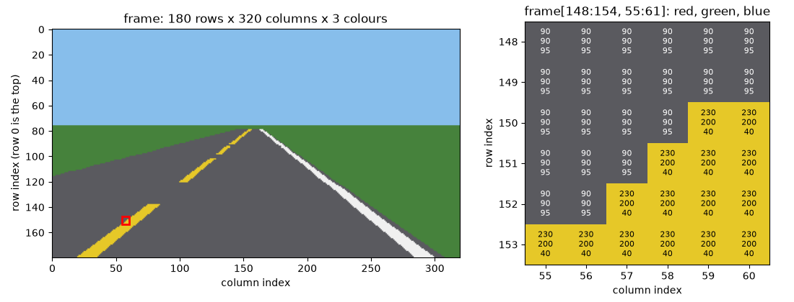
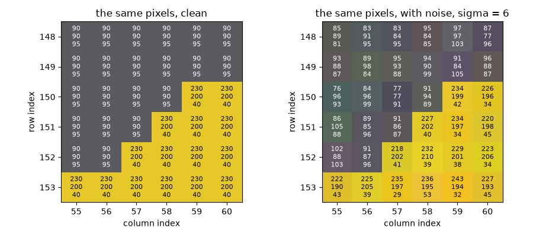
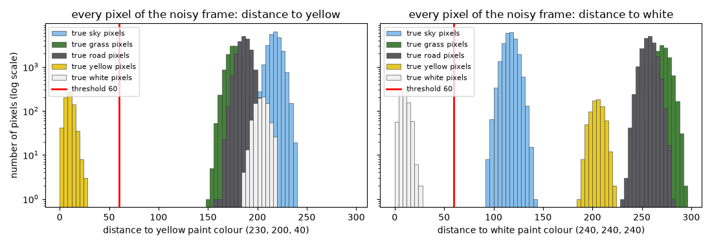
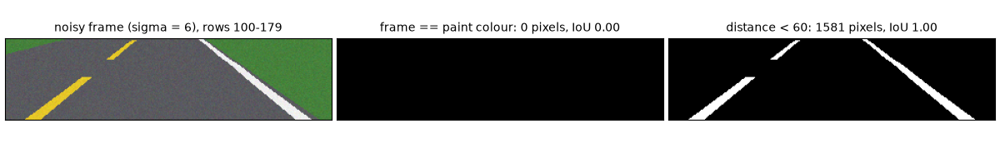

# Images are arrays

## A frame is a grid of numbers

A paper from 1988 describes a van that drove itself along a 400 m path through a wooded area of the Carnegie Mellon University campus, steered by a small neural network called ALVINN. The network never saw the camera picture the way you do. It saw numbers:

> "The first retina, consisting of 30x32 units, receives video camera input from a road scene. The activation level of each unit in this retina is proportional to the intensity in the blue color band of the corresponding patch of the image." (Pomerleau, 1988, p. 306)

A grid of 30 by 32 brightness values, 960 numbers, was all the network saw of the camera picture.

Your car's camera gives you more numbers, but they are still just numbers. Every 0.05 s it hands the perception box one **frame**: a NumPy array of shape `(180, 320, 3)`. That is 180 rows, 320 columns, and 3 colour values per pixel, $180 \times 320 \times 3 = 172{,}800$ numbers in all.

You pick one number out with three indices, `frame[row, column, channel]`:

- **row** runs from 0 at the **top** of the picture to 179 at the bottom. Rows near the bottom show the road just in front of the car.
- **column** runs from 0 at the left edge to 319 at the right edge.
- **channel** is 0 for red, 1 for green and 2 for blue. Leave it out and you get all three: `frame[0, 0]` is the top-left pixel's colour, `(135, 190, 235)`, which is sky blue.

Every value is a whole number from 0 to 255. The array's **dtype**, its number type, is `uint8`: an unsigned integer stored in 8 bits, and 8 bits can hold $2^8 = 256$ different values. 0 means none of that colour and 255 means as much as the camera can record.



Zoom in on the red box and the picture dissolves into its numbers. The grey road pixels are all `(90, 90, 95)`; the yellow paint pixels are all `(230, 200, 40)`. The boundary between them is a staircase, because a slanted line drawn on a grid of squares always is.

This flat-world teaching simulator paints the world in exactly five colours:

| Surface | Red | Green | Blue |
|---|---|---|---|
| sky | 135 | 190 | 235 |
| grass | 70 | 130 | 60 |
| road | 90 | 90 | 95 |
| yellow paint | 230 | 200 | 40 |
| white paint | 240 | 240 | 240 |

In the frame above, rows 0 to 75 are all sky: the horizon of a flat world sits at row 75.5. The paint the car needs is a thin sliver. Of the frame's $180 \times 320 = 57{,}600$ pixels, 709 are yellow and 872 are white, 2.7% in all. The job of this unit is to find them.

## Colour is a point in space

Three numbers can be read as a position in space. Treat red, green and blue as three axes, like the length, width and height of a room, and every colour becomes a point in a cube whose sides run from 0 to 255. Similar colours are points close together.

That gives you a way to ask "how close is this pixel's colour to yellow?": measure the straight-line distance between the two points. For a pixel colour $p = (p_R, p_G, p_B)$ and a reference colour $c = (c_R, c_G, c_B)$, where the subscripts $R$, $G$ and $B$ name the red, green and blue values,

$$d(p, c) = \sqrt{(p_R - c_R)^2 + (p_G - c_G)^2 + (p_B - c_B)^2}$$

This is Pythagoras' theorem with one extra axis. The distance is 0 when the colours are identical, and grows as they differ.

**Worked example.** How far is road grey $p = (90, 90, 95)$ from yellow paint $c = (230, 200, 40)$?

- Differences: $90 - 230 = -140$, $90 - 200 = -110$, $95 - 40 = 55$.
- Squares: $19{,}600$, $12{,}100$ and $3{,}025$. They add up to $34{,}725$.
- Square root: $\sqrt{34{,}725} = 186.3$.

Work out every pair of the five colours the same way and two facts stand out. The colour nearest to yellow is grass, 175.8 away. The colour nearest to white is sky, only 116.4 away. Keep those two numbers in mind.

## Paint is a colour threshold

Real cameras are not perfect. Each value comes back nudged up or down a little by electrical **noise**. The simulator can imitate this: with `noise_sigma=6` it adds a random amount to every channel of every pixel. The symbol $\sigma$ (sigma) is the typical size of the nudge, its standard deviation: about two thirds of the nudges are smaller than 6, and very few are bigger than 18. The result is rounded and kept within 0 to 255.



Pixel (150, 60) was `(230, 200, 40)` and is now `(226, 196, 34)`. Its distance from yellow is $\sqrt{(-4)^2 + (-4)^2 + (-6)^2} = \sqrt{68} = 8.25$. Not zero, but tiny next to the 186.3 between road and yellow.

So decide it with a **threshold**, a cut-off distance written $\tau$ (tau): a pixel counts as yellow paint when

$$d(p, c_{\text{yellow}}) < \tau$$

Asking that question of every pixel gives a **mask**: a `bool` array of shape `(180, 320)` holding `True` where the answer is yes. With `yellow` holding the three numbers of yellow paint, NumPy asks all 57,600 questions in two lines:

```python
distance = np.linalg.norm(frame.astype(float) - yellow, axis=-1)  # shape (180, 320)
yellow_mask = distance < tau                                      # shape (180, 320), dtype bool
```

`frame.astype(float) - yellow` subtracts the three-number `yellow` from every pixel at once, which NumPy calls **broadcasting**. `np.linalg.norm(..., axis=-1)` then takes the square root of the sum of squares along the last axis, the colour axis, leaving one distance per pixel. The `astype(float)` matters, as the last section shows.

How big should $\tau$ be? Look at the distance of every pixel in a noisy frame:



In this frame, noise moved no yellow pixel more than 27.8 from yellow and no white pixel more than 24.8 from white. The nearest pixel that is *not* yellow paint is 151.2 away from yellow; the nearest non-white one is a noisy sky pixel 92.2 from white. Any $\tau$ inside that gap separates paint from everything else. The provided perception box uses $\tau = 60$.

Stray outside the gap and you see why it has to be there. On this frame, $\tau = 10$ keeps only 55% of the yellow paint. For white, $\tau = 120$ reaches past the gap into the sky: it marks 18,098 pixels instead of 872.

## Scoring a mask with IoU

How do you say how good a mask is? The simulator knows which pixels truly are paint, so there is a correct mask $T$ (for "truth") to compare your mask $M$ with. The course uses **intersection over union**, IoU:

$$\text{IoU}(M, T) = \frac{|M \cap T|}{|M \cup T|}$$

Here $M \cap T$ (the intersection) is the set of pixels marked in both masks, $M \cup T$ (the union) is the set marked in either, and $|\cdot|$ means "how many pixels". In NumPy, `&` is "both" and `|` is "either", so the IoU is `(M & T).sum() / (M | T).sum()`.

**Worked example.** The truth has 10 paint pixels. Your mask marks 8 of them, plus 4 pixels that are not paint. The intersection is 8. The union is the 10 true pixels plus your 4 wrong ones, 14. So IoU $= 8 / 14 = 0.571$.

IoU is 1 only when the two masks are identical, and it punishes both kinds of mistake: missed paint shrinks the top, and false paint grows the bottom.

Why not simply count the fraction of pixels you got right? Because paint is so rare. A mask that marks nothing at all is right about 98.8% of the pixels for yellow, since only 1.2% of the frame is yellow paint. Its IoU is 0. The grader for this unit asks for IoU of at least 0.85 for both masks, on six noisy frames drawn from all three roads.

## Why exact equality fails

Here is the tempting shortcut: "The simulator paints yellow as exactly `(230, 200, 40)`. So find yellow with `frame == yellow`."

On a clean frame this works perfectly: IoU 1.0. On a noisy frame it finds nothing:



To equal yellow exactly, a noisy pixel needs all three of its nudges to round to 0. One nudge does that only when it lands between $-0.5$ and $+0.5$, which with $\sigma = 6$ happens with probability 0.066. All three at once: $0.066^3 = 0.0003$. Out of 709 yellow pixels you would expect to find about 0.2, and in this frame you find none.

The lesson reaches far beyond paint. Measured data never lands exactly on its ideal value, so never test it for equality: test whether it is close enough. (There is a second trap in `frame == yellow` too. It compares channel by channel, giving shape `(180, 320, 3)`, so you would need `np.all(..., axis=-1)` just to get one answer per pixel.)

## The uint8 wraparound trap

Suppose you skip `astype(float)` and subtract directly: `frame - yellow`, with both arrays `uint8`. That is easy to do by accident, because the simulator's own colour table, `PALETTE`, is `uint8` too. A `uint8` cannot hold a negative number, so NumPy wraps the result around, silently: it adds 256 until the answer fits.

$$90 - 230 = -140 \quad\longrightarrow\quad -140 + 256 = 116$$

So road grey minus yellow comes out as `(116, 146, 55)` instead of `(-140, -110, 55)`. Squares overflow the same way: $20^2 = 400$ does not fit either, and $400 - 256 = 144$.

The damage depends on the noise. A paint pixel keeps a correct, small distance only if no channel dipped below the paint colour. When one did, $-2$ becomes $254$, and the pixel looks nothing like paint. In the noisy frame above that leaves 13.5% of the yellow pixels and 13.9% of the white ones, so the masks score an IoU of 0.14. No error, no warning: just a mask that is mostly empty.

The fix is one call: convert to a type that can go negative before you subtract, `frame.astype(float)`. Whenever you do arithmetic on image data, convert first.

## Go deeper

- **NumPy: the absolute basics for beginners**, sections "Array attributes" (shape, dtype) and "Indexing and slicing", which ends with picking out values with a condition and combining conditions with `&` and `|`.
- **CS231n Python Numpy Tutorial**, sections "Array indexing" (read "Boolean array indexing"), "Datatypes" and, under Matplotlib, "Images".
- **Pomerleau, "ALVINN: An Autonomous Land Vehicle in a Neural Network" (1988)**, p. 306, "Network Architecture" and Figure 1: the 30 by 32 camera grid and why it used the blue band. This is the module paper; you will read it properly in unit 0.1.4.
