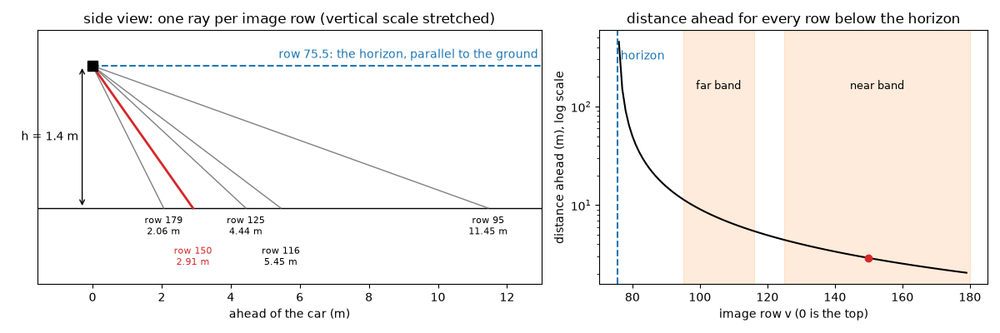
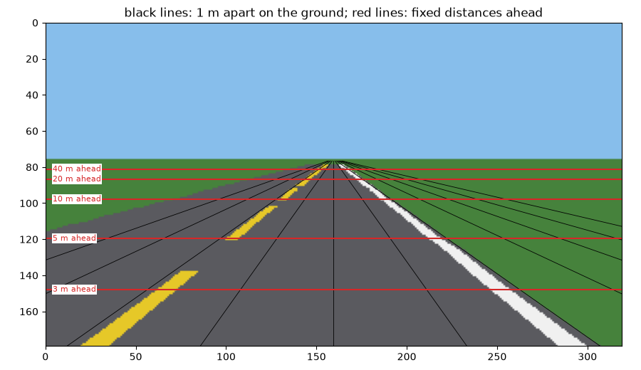
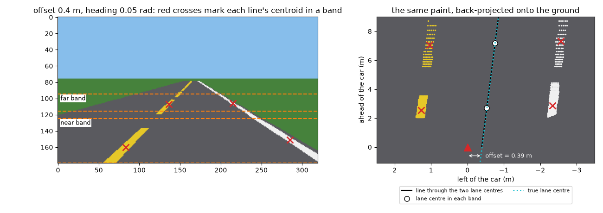
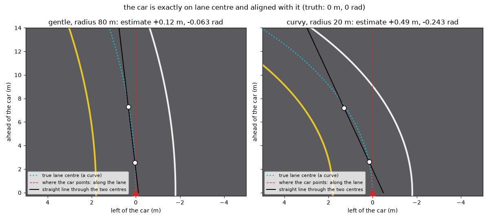

# Your first perception box

## The horizon

Your `paint_masks` from unit 0.1.2 finds the paint pixels, but the controller wants two numbers: how far the car is from lane centre in metres (the **offset**, positive when left of centre) and which way it points relative to the lane in radians (the **heading**, positive when pointing left of the lane). This unit builds the box in between, `estimate_lane(obs)`, which returns a `LaneEstimate(offset_m, heading_rad, valid)`.

The bridge from pixels to metres is one assumption. A 2008 lane-detection paper states it in its first step:

> "To get the IPM of the input image, we assume a flat road, and use the camera intrinsic (focal length and optical center) and extrinsic (pitch angle, yaw angle, and height above ground) parameters to perform this transformation." (Aly, 2008, §II.A)

IPM, inverse perspective mapping, redraws the picture as if seen from straight above, so "lanes that appear to converge at the horizon line are now vertical and parallel." You will do it for just the pixels you need.

In this flat-world teaching simulator the ground is exactly a plane, and you know every camera number. The camera sits $h = 1.4$ m above the ground, directly above the front axle, tipped down by a **pitch** of $p = 5°$. Its **focal length** is $f = 160$ pixels: a ray at angle $\alpha$ from the direction the camera points lands $f \tan\alpha$ pixels from the image centre, which is column $c_x = 159.5$, row $c_y = 89.5$.

The horizon is where a ray parallel to the ground lands. That ray points 5° *above* the camera's axis, so it lands $f \tan 5° = 160 \times 0.0875 = 14.0$ rows above the centre: row $89.5 - 14.0 = 75.5$. Rows above it see sky, which is why rows 0 to 75 of the 0.1.2 frame were all sky.

## Rows are distances

Take a row $v$ below the horizon. Its ray points $\arctan\frac{v - c_y}{f}$ below the camera's axis, and the axis points $p$ below horizontal, so the ray falls at

$$\theta = p + \arctan\frac{v - c_y}{f}$$

below horizontal. It starts at height $h$ and meets the ground a distance $d$ ahead: a right-angled triangle with $\tan\theta = h / d$, so

$$d = \frac{h}{\tan\theta}$$

**Worked example.** How far ahead is the ground seen in row 150?

- $(150 - 89.5) / 160 = 0.378$, and $\arctan 0.378 = 20.71°$.
- $\theta = 5° + 20.71° = 25.71°$, and $\tan 25.71° = 0.4815$.
- $d = 1.4 / 0.4815 = 2.91$ m.

The column never appears in the formula: every pixel in row 150 sees ground 2.91 m ahead. A row is a distance.

`Camera.pixel_to_ground(u, v)` does this for you: it takes a column $u$ and a row $v$ and returns the ground point `(forward, left)` in metres from the camera, left positive, or NaN (not a number) above the horizon. The lab checks the worked example against it; module 1.4 opens it up.

The distances are uneven: at the bottom one row is 4 cm of road, near row 100 it is 36 cm, and ten rows below the horizon you are past 50 m. Rows near the horizon are too coarse to trust, so the box measures in two bands: the **near band**, rows 125 to 179 (2.1 to 4.4 m ahead), and the **far band**, rows 95 to 115 (5.6 to 11.5 m).

## Metres per pixel

The tempting shortcut: "The lane is 3.6 m wide. Count the columns it spans, divide, and you know the metres per column; multiply any pixel's column by it." That fails, because **a pixel column is not a fixed number of metres**. Sideways distances shrink with distance, just as a far-off car looks smaller.

A point $L$ metres to the left and about $d$ metres ahead appears roughly $f L / d$ columns from the centre, so one column covers about

$$\text{metres per column} \approx \frac{d}{f}$$

Measured with `pixel_to_ground`, one column covers 0.0189 m in row 150 (2.91 m ahead), 0.0574 m in row 100 (9.09 m ahead) and 0.312 m in row 80 (50.1 m ahead), each close to $d/f$; the 5° pitch accounts for the differences.

**Worked example.** The 3.6 m lane spans $3.6 / 0.0189 = 191$ columns in row 150 but $3.6 / 0.0574 = 63$ in row 100. Slide the car 0.5 m left and the white line moves $0.5 / 0.0189 = 26.5$ columns in row 150, but only $0.5 / 0.0574 = 8.7$ in row 100; the lab measures both. To turn a pixel into metres you need its row as well as its column.

## From masks to a lane estimate

Offset and heading describe the **lane centre**, halfway between the yellow line and the white line, which are 3.6 m apart. The box finds two points on it and draws a straight line through them:

1. **Masks:** `yellow, white = paint_masks(obs.frame)`.
2. **Centroids:** in each band, each line's **centroid** is the mean column and mean row of its paint pixels there. The centroid of a thin line lies on the line, so it is a point on the paint; `pixel_to_ground` turns it into `(forward, left)`.
3. **Lane centre:** in each band, the midpoint of the yellow and white ground points. That gives a near point $(f_1, c_1)$ and a far point $(f_2, c_2)$, forward first.
4. **Line:** its **slope**, the metres it drifts left per metre ahead, is $(c_2 - c_1) / (f_2 - f_1)$.

At the car, forward $= 0$, the line is at left $= c_1 - \text{slope} \cdot f_1$; if the lane centre is 0.4 m to the car's right, the car is 0.4 m left of the lane centre. The line points $\arctan(\text{slope})$ left of the car; if the lane points left of the car, the car points right of the lane. So

$$\text{offset} = -(c_1 - \text{slope} \cdot f_1), \qquad \text{heading} = -\arctan(\text{slope})$$

Both minus signs switch from the lane seen by the car to the car seen by the lane.

**Worked example.** The car is on the straight road, truly 0.4 m left of centre and turned 0.05 rad left (the frame above).

- Near band: the yellow line's 553 pixels have their centroid at column 83.02, row 159.85: ground point (2.55, 1.27). The white line's 543 pixels give (2.87, −2.33). Their midpoint, the near lane centre, is (2.71, −0.53).
- Far band: yellow (99 pixels) at (7.05, 1.05), white (104 pixels) at (7.33, −2.57), lane centre (7.19, −0.76).
- $\text{slope} = (-0.76 + 0.53) / (7.19 - 2.71) = -0.0512$: the lane centre drifts right as it goes ahead.
- $c_1 - \text{slope} \cdot f_1 = -0.53 + 0.0512 \times 2.71 = -0.39$, so the offset is $+0.39$ m (truth 0.40), and the heading is $-\arctan(-0.0512) = +0.051$ rad (truth 0.05). The arithmetic uses unrounded values.

## What valid=False is for

Sometimes there is nothing to measure: turn the car 0.6 rad left on a straight road and the white line leaves the near band: 0 pixels, so no lane centre and no line. The box counts a line as seen in a band only with at least 3 pixels there.

What should `estimate_lane` return then? Offset 0 and heading 0 is a lie: it tells the controller "you are perfectly centred" when you know nothing, and the controller will act on it. Return `LaneEstimate(math.nan, math.nan, False)`. `valid=False` says plainly there is no estimate, and the NaNs spoil any sum that forgets to check, so the mistake shows up.

What to do then is the controller's decision: the provided controller checks `valid` first and, when it is `False`, holds the wheel straight. With the provided box on `gentle`, all 1,778 steps are valid.

## Straight roads only

Your box fits a *straight* line, which is exact on a straight road: on 40 centred, aligned frames along it, every estimate is within 0.01 m and 0.003 rad. On a bend the lane centre is a curve, and a straight line through two points on a curve, a **chord**, does not point along the curve at the car. The estimate is wrong even when the car is placed perfectly:

You can predict the error. On a bend of radius $R$ turning left, the lane centre $s$ metres ahead has drifted about $s^2 / (2R)$ to the left. With the near point $s_1$ metres ahead and the far point $s_2$, the line through them has

$$\text{slope} = \frac{s_2^2 - s_1^2}{2R\,(s_2 - s_1)} = \frac{s_1 + s_2}{2R}, \qquad \text{left at the car} = -\frac{s_1 s_2}{2R}$$

so the box reports an offset of $s_1 s_2 / (2R)$ and a heading of $-\arctan\frac{s_1 + s_2}{2R}$ where both should be 0. With $s_1 \approx 2.7$ m and $s_2 \approx 7.2$ m, that predicts errors of 0.12 m and 0.062 rad on `gentle` ($R = 80$ m) and 0.49 m and 0.25 rad on `curvy` ($R = 20$ m). On 40 centred frames in each road's bends, the median errors are 0.13 m and 0.065 rad on `gentle`, as predicted, and 0.60 m and 0.30 rad on `curvy`: there, your lane's radius is only 18.2 m on right bends, and the far midpoint sits about 0.1 m inside the lane centre.

This is a **bias**, not noise: on a left bend the box always says "left of centre, pointing right", so the controller steers further left and the car cuts to the inside. That is why the grader tests your function on straight roads only: none of those bend frames falls within its tolerances of 0.25 m and 0.05 rad. Better lane models fit curves through many rows; that is module 1.5, "Classical lane perception". Unit 0.1.4 shows what this bias does to the car on `curvy`.

## Swap your perception into the car

`Car(perception=estimate_lane)` is the provided car with your perception inside: every 0.05 s it calls your function with an `Observation` holding the camera frame `obs.frame`, the speed `obs.speed` and the time `obs.t`.

Check `0.1.3.b` drives that car around `gentle`: it must complete the lap with a mean lateral error below 0.5 m (the provided box manages 0.38 m), and it refuses a car still running the provided perception.

One flipped sign turns a working box into a dangerous one. With the offset's sign wrong, the car believes it is left of centre when it is right, and steers *away* from the centre; each correction makes the error bigger, and the bigger error a bigger wrong correction. This is **positive feedback**. In the lab the error roughly doubles every half second until the car leaves the lane after 5 s, still on the first straight.

## Go deeper

- **Stanford CS231A Course Notes 1, "Camera Models"** (Hata and Savarese), §2 "Pinhole cameras": the similar triangles behind $f L / d$.
- **Aly, "Real time Detection of Lane Markers in Urban Streets" (2008)**, §II.A "Inverse Perspective Mapping (IPM)" and Figures 2 and 3: the flat-road top view of a real street. The rest can wait for module 1.5.
- **Szeliski, "Computer Vision: Algorithms and Applications" (2nd ed.)**, §2.1.4 "3D to 2D projections", subsections "Perspective" and "Camera intrinsics". A graduate textbook (free after a short form); keep it for module 1.4.
