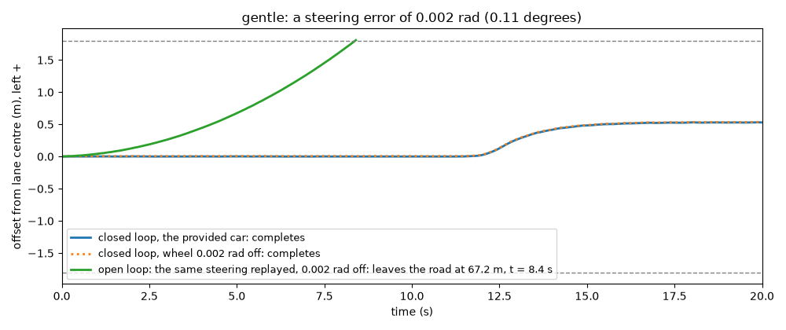
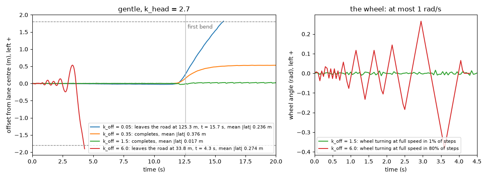
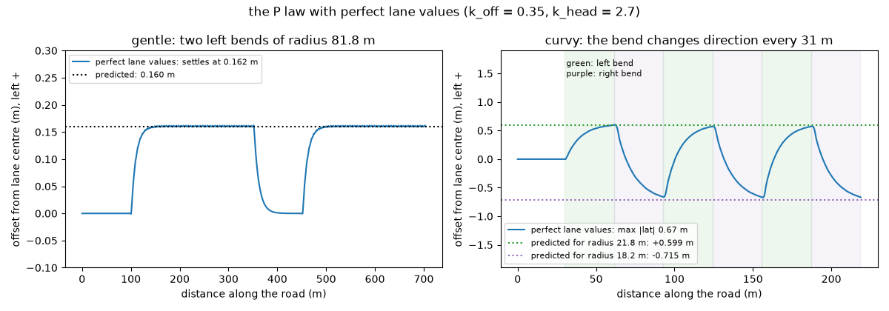
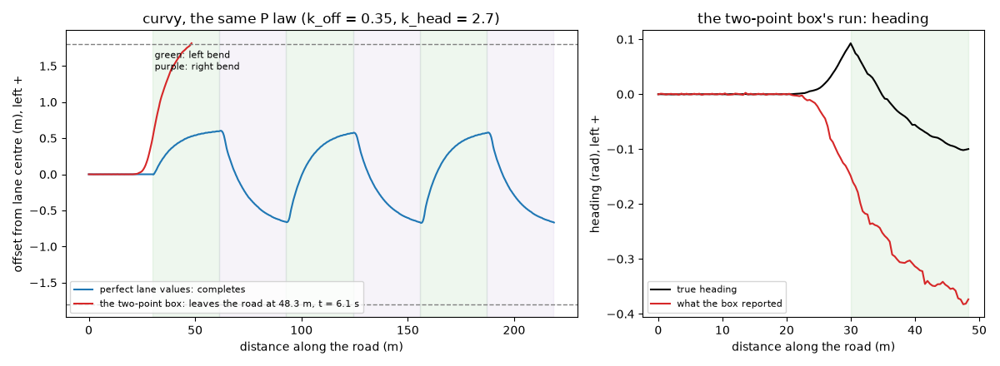

# Closing the loop

## Open loop and closed loop

Your car now sees through your perception box. This unit opens the last box, the **controller**: every 0.05 s it receives your `LaneEstimate` and returns a steering angle.

Record every steering angle the provided car used on its lap of `gentle`, then replay the recording without looking at the camera. Replayed exactly, it gives the same lap. Now set the wheel 0.002 rad (0.11 degrees) off. The replayed car leaves the road after 67.2 m, 8.4 s in, still on the first straight. The provided car, with the same 0.002 rad error, completes the lap with a mean |lateral error| of 0.381 m instead of 0.376 m.

The replay is **open loop**: its commands were fixed in advance, so nothing notices the error and it adds up. The provided car is **closed loop**: each command is computed from the latest measurement, so an error is corrected as soon as it shows. Åström and Murray define it:

> "The term feedback refers to a situation in which two (or more) dynamical systems are connected together such that each system influences the other" (§1.1)

Here the two systems are the car, turning a steering angle into a new position, and the controller, turning the camera's view of that position into the next steering angle.

## The P controller

The 2006 paper on Stanford's robot car Stanley puts it in one line: "The larger this error, the stronger the steering response toward the trajectory." (Thrun et al., p. 684). The simplest law with that property is **proportional control**:

$$u = k_p\,(r - y) = k_p\,e$$

(Åström & Murray, Eq. 1.3). Here $u$ is the controller's output, $r$ the **reference** (the value you want), $y$ the measured value, $e = r - y$ the control error and $k_p$ the **gain**, how hard to push per unit of error.

For your car, $u$ is the steering angle $\delta$ (radians, left positive), the reference is offset 0 and the measurement is the offset $e_{\text{off}}$. So $r - y = -e_{\text{off}}$ and

$$\delta = -k_{\text{off}}\, e_{\text{off}}$$

with $k_{\text{off}}$ in radians of wheel per metre. The minus sign is the whole point: 0.4 m left of centre with $k_{\text{off}} = 0.35$ gives $\delta = -0.14$ rad, steering right, towards the centre. Steering *against* the error is **negative feedback**; drop the minus sign and you get unit 0.1.3's positive feedback.

Two guards complete the law:

- **Clip** the result to ±0.5 rad, the furthest the simulator's wheel turns, with `np.clip`.
- If `est.valid` is `False`, return 0.0: hold the wheel straight rather than steer on NaNs.

## Two errors, two gains

A car on lane centre but pointing 0.05 rad left is fine now, not in a second: at 8 m/s it moves $8 \sin 0.05 = 0.40$ m sideways every second. A heading error is an offset in the making, so the controller uses both errors:

$$\delta = -\left(k_{\text{off}}\, e_{\text{off}} + k_{\text{head}}\, \psi\right), \quad \text{clipped to } \pm 0.5$$

where $\psi$ is the heading in radians, left positive, and $k_{\text{head}}$ has no units. The provided car uses $k_{\text{off}} = 0.35$ and $k_{\text{head}} = 2.7$.

**Worked example.** The car is 0.4 m left of centre and pointing 0.05 rad left:

$$\delta = -(0.35 \times 0.4 + 2.7 \times 0.05) = -(0.14 + 0.135) = -0.275 \text{ rad}$$

Firmly right. Same offset, but pointing 0.05 rad *right*, back towards the centre: $\delta = -(0.14 - 0.135) = -0.005$ rad, almost straight. The car is already coming back, so the controller eases off. Without the heading term it would steer right all the way to the centre, arrive pointing across the lane and swing past.

The lab pushes the car 1.10 m left, then hands over to the P law with $k_{\text{off}} = 0.35$. With $k_{\text{head}} = 0$ the car swings 0.30 m past the centre. With $k_{\text{head}} = 1$ it settles within 5 cm in 1.15 s, never a millimetre past. With $k_{\text{head}} = 2.7$ it creeps back and takes 3.10 s. The heading gain is a brake on the swing: too little overshoots, too much is sluggish.

## Tuning the gains

Keep $k_{\text{head}} = 2.7$ and sweep $k_{\text{off}}$ on `gentle`:

- $k_{\text{off}} = 0.05$: offsets go uncorrected for seconds; at the first bend the car drifts inside and leaves the road at 125.3 m.
- $0.35$, the provided value: completes, mean |lateral error| 0.376 m.
- $1.5$: completes, 0.017 m.
- $3.0$ (in the lab): completes, 0.042 m.
- $6.0$: leaves the road after 33.8 m, 4.3 s in, still on the first straight.

The tempting conclusion is **"more gain, tighter tracking"**. It holds from 0.05 to 1.5, then fails: 3.0 is worse than 1.5, and 6.0 crashes. The reason is the wheel, which turns at most 1 rad/s. With $k_{\text{off}} = 6$, a 5 cm offset asks for 0.3 rad of wheel, which takes 0.3 s to reach, 2.4 m of travel at 8 m/s. By then the car has crossed the centre and the controller wants the opposite. The right panel shows it: at $k_{\text{off}} = 6$ the wheel turns at full speed in 80% of steps, always late, each swing wider than the last. There is a best range of gains, and the car's limits set its top.

## Why curves need error

To follow a circle of radius $R$, a car with wheelbase $L = 2.7$ m (front axle to rear axle) holds its wheel at about

$$\delta \approx \arctan\frac{L}{R}$$

because the car turns about the point where lines drawn square to its front and rear wheels meet. On `gentle`'s bends your lane has radius 81.8 m (80 m plus 1.8 m: your lane is on the outside), so $\delta = \arctan(2.7 / 81.8) = 0.0330$ rad.

A P law turns the wheel only when there is error. With both errors zero it says $\delta = 0$, and the car runs straight off the circle. So in a steady bend the car must carry errors that add up to the right $\delta$.

Which errors? The car's position is measured at its front axle, which travels where the front wheels point: the car's heading plus $\delta$. For the front axle to run along the lane, the front wheels point along the lane, so the body points $\delta$ to the *outside*: $\psi = -\delta$ on a left bend. The heading term then gives $-k_{\text{head}}\psi = 2.7\,\delta$, 2.7 times what is needed. The offset term must take back the extra $1.7\,\delta$: $k_{\text{off}}\, e_{\text{off}} = (k_{\text{head}} - 1)\,\delta$, so

$$e_{\text{off}} = \frac{(k_{\text{head}} - 1)\,\delta}{k_{\text{off}}}$$

**Worked example.** On `gentle`: $1.7 \times 0.0330 / 0.35 = 0.160$ m, to the left, the inside of the bend. Given perfect lane values instead of your box's, the car settles at 0.162 m.

On `curvy` the bends have radius 20 m, so your lane's radius is 21.8 m on left bends and 18.2 m on right bends: $\delta = 0.123$ and $0.147$ rad, predicting 0.599 m and −0.715 m. Each bend is only 31 m long, so the offset is still moving when the next one begins; with perfect lane values the car stays within 0.67 m and completes `curvy`.

Åström and Murray name this: "proportional control has the drawback that the process variable often deviates from its reference value" (§1.6). Here the deviation grows as the bend tightens, because $\delta \approx L/R$.

Set $k_{\text{head}} = 1$ and the offset vanishes. Stanley's law, Eq. 7, is $\delta(t) = \psi(t) + \arctan\frac{k\,x(t)}{u(t)}$, where "The angle ψ in this diagram describes the orientation of the nearest path segment, measured relative to the vehicle's own orientation" (p. 684): minus your heading, with gain exactly 1. Module 1.3 derives it.

## Why your car leaves curvy

With perfect lane values the P law gets round `curvy`. The provided car does not: it leaves the road at 48.3 m, 6.1 s in, off the inside of the first left bend. Yours will too, if your box works like it.

The cause is unit 0.1.3's chord bias: on a left bend the box says "left of centre, pointing right" even when the car is centred, and the controller multiplies the heading by 2.7. It starts early: the far band sees 5.6 to 11.5 m ahead, so at 30.3 m, where the bend begins, the car is already 0.56 m left.

**Worked example.** At 44.3 m the car is truly 1.70 m left, heading −0.085 rad; the box reports 2.32 m and −0.342 rad.

- On the true values: $-(0.35 \times 1.70 + 2.7 \times (-0.085)) = -0.366$ rad, hard right, back to the centre.
- On the box's values: $-(0.35 \times 2.32 + 2.7 \times (-0.342)) = +0.110$ rad, left, deeper inside.

A heading error of 0.257 rad times 2.7 is 0.69 rad of phantom left steering, outweighing everything else.

Retuning can hide this: $k_{\text{off}} = 1.5$, or $k_{\text{head}} = 1$, gets round `curvy` (mean errors 0.085 and 0.131 m), but the bias remains. The real fixes are perception that fits the curve (module 1.5) and a controller that looks ahead along the road (module 1.3).

## Closing the loop

Your last step is `my_car = Car(perception=estimate_lane, controller=my_controller)`, where `my_controller(est, obs)` returns `p_steer(est, K_OFF, K_HEAD)`. A controller that returns a number is a steering angle; the `Car` pairs it with the provided speed controller, which holds 8 m/s (module 1.2).

Check `0.1.4.b` requires a `Car` running neither provided box to complete `gentle` with a mean |lateral error| below 0.5 m. Then it drives `curvy`, ungraded, so you see what your own car does there. Every box is now yours.

## A 1988 car that learned to steer

Your car has hand-written perception and control. In 1988, Dean Pomerleau replaced both with one network: ALVINN, "a 3-layer back-propagation network designed for the task of road following" (p. 305).

- **Inputs:** a 30x32 video retina fed the blue colour band, an 8x32 laser range-finder retina and one feedback unit: 1217 inputs, into 29 hidden units.
- **Outputs:** 45 direction units, from sharp left to sharp right, the middle one "travel straight ahead" (p. 306). Its training target is the curvature "which would bring the vehicle to the road center 7 meters ahead of its current position" (p. 306): it aims at a point ahead, not at the error at the car.
- **Training:** 1200 simulated road snapshots.
- **Result:** it drove the NAVLAB van "at a speed of 1/2 meter per second along a 400 meter path through a wooded area" (pp. 308–309). CMU's traditional system, on the faster Warp computer, managed 1 m/s.
- **Limit:** at a fork it could output two directions, and "The result is often an oscillation" (p. 312).

It is this module's paper.

## Go deeper

- **Åström & Murray, "Feedback Systems" (2nd ed.)**, §1.1 "What Is Feedback?" and §1.6 "Simple Forms of Feedback": proportional control and its offset.
- **Thrun et al., "Stanley: The Robot that Won the DARPA Grand Challenge" (2006)**, §9.2 "Steering Control", Eq. 7 and Figure 24 (p. 684).
- **Pomerleau, "ALVINN: An Autonomous Land Vehicle in a Neural Network" (1988)**: start with Figure 1 and "Network Architecture".
